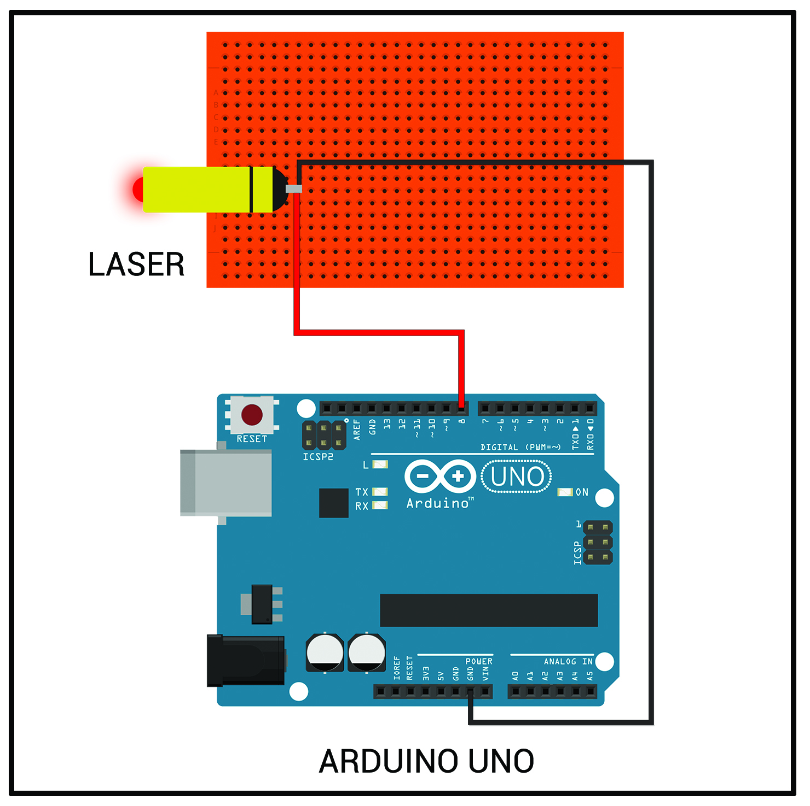
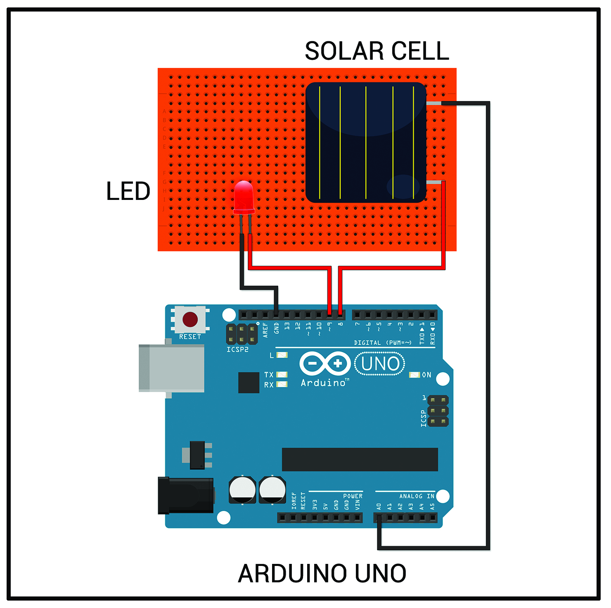

# Laser-Data-Transmission
Textual data transmission using Laser and Arduino
(First Arduino Project)

# Circuit Schematics
Transmitter circuit

Receiver circuit

# Working
The input string is converted into binary with each letter of 8-bit ASCII representation.
The receiver parses the string into 8-bit pieces and converts them back to their character representation using the ASCII table.

# Future Improvements

I made this project back when i had no knowledge of encoding techniques.
*- The input sequence can be encoded using a method like "Hamming Encoding" or "BCH Encoding".
*- Optimization needs to be done for faster data transfer
